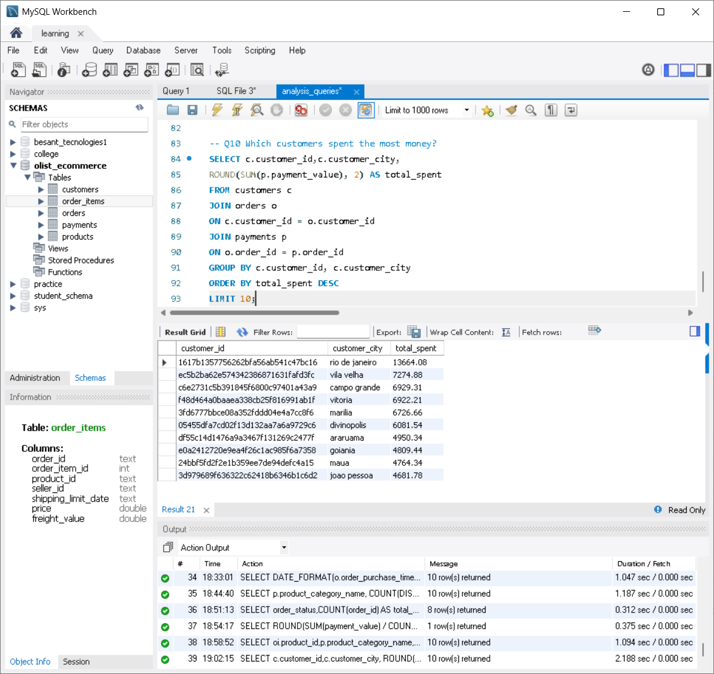

# E-commerce SQL Analysis

## Project Overview
This project analyzes an e-commerce dataset using SQL. The goal is to find useful business insights related to orders, revenue, customers, payments, and products.

## Dataset Tables Used
- customers
- orders
- order_items
- payments
- products

## Tools Used
- MySQL
- MySQL Workbench
- GitHub

## Key Analysis Questions
1. What is the total number of orders?
2. What is the total revenue generated?
3. Which payment type generates the highest revenue?
4. Which cities have the highest number of orders?
5. How much revenue was generated each month?
6. Which product categories have the highest number of orders?
7. How many orders are there for each order status?
8. What is the average amount spent per order?
9. Which products generated the highest revenue?
10. Which customers spent the most money?

## Project Files
- `Insights.md` - Contains business questions, results, and insights.
- `analysis_queries.sql` - Contains all SQL queries used for analysis.
- `Screenshots` - Contains screenshots of SQL query outputs.

## Screenshots

### 1. Total Orders

### 2. Total Revenue

### 3. Revenue by Payment Type

### 4. Top 10 Cities by Orders

### 5. Monthly Revenue Trend

### 6. Top 10 Product Categories by Orders

### 7. Orders by Order Status

### 8. Average Order Value

### 9. Top 10 Products by Revenue

### 10. Top 10 Customers by Total Spending

## Business Insights
The analysis helps understand e-commerce performance, customer behavior, revenue trends, popular product categories, payment preferences, and high-value customers.

## Conclusion
This project helped me practice SQL concepts such as joins, aggregation, grouping, ordering, date functions, and business analysis using real-world e-commerce data.
